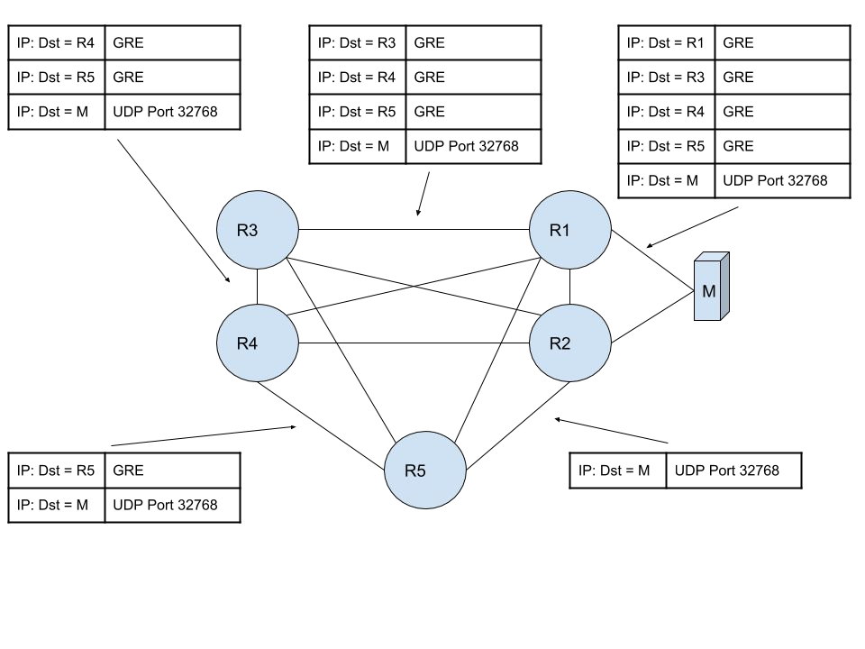

# Matroschka-Prober
Matroschka-Prober is a GRE based blackbox network monitoring tool

## How it works
Matroschka functions by stacking GRE headers on top of one another. Each GRE header represents a node or hop. Upon arrival at the hop, the network device decapsulates the package (using a previously configured filter) and forwards it to the next destination. The final packet uses the UDP protocol to return it to the original sender.
Matroschka makes it possible to test any arbitrary path in the network, even those that are not the shortest path.

## Key features
- Packets get decapsulated by the ASIC avoiding using valuable CPU time for monitoring
- Source IP Addresses can be spoofed within IP Subnets, useful to randomize the values used by ECMP capable devices to hash and route packets
- Configurable TOS/DSCP values
- Configurable PPS rates
- Configurable packet payload sizes
- Configurable measurement durations
- Provides metrics on /metrics for Prometheus

## Configuration examples to decapsulate packets

### Junos
`
term DECAP {
    from {
        destination-address {
            10.1.0.255/32;
        }
        protocol gre;
    }
    then {
        decapsulate gre;
        }
    }
    term ACCEPT {
    then accept;
}
`
### Linux
`# ip tunnel add gre_decap mode gre local 192.0.2.0 ttl 255
``# echo 1 > /proc/sys/net/ipv4/conf/ip_forwarding
`Necessary if you can’t spoof addresses:
``# echo 1 > /proc/sys/net/ipv4/conf/<input_dev>/accept_local
`

## [Configuration](config.md)
